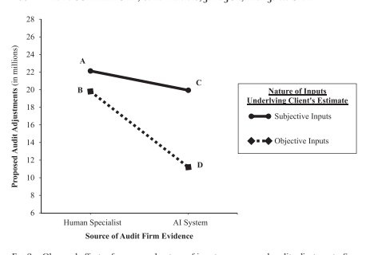
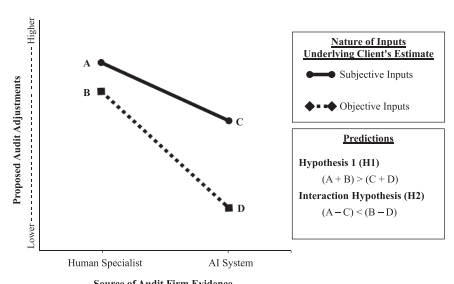
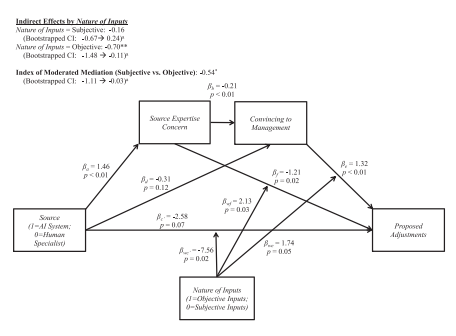

【章首個案】大山背博物館 台灣新竹縣的橫山鄉有內灣鐵路連接竹北高鐵站以及新竹市火車站,又有三號省道貫 穿,68 號快速道路連接國道一號與三號,交通便利。發源於尖石鄉的油羅溪經過大山背山麓, 在竹東鎮邊與上坪溪匯流進入頭前溪。傳統的客家聚落散佈在山麓與溪旁的農田間,雖然許 多已經改建洋房,從庭院醃大菜和曬蘿蔔的意象裡,仍然可以體驗客家的生活面貌。在山、 河、丘陵與農田的自然環境裡,加上便捷的鐵公路交通,以及純樸友善的客家文化,橫山蘊 含著如瑞士小鎮的自然與文化價值。

然而,距離新竹科學園區僅 20 分鐘車程的橫山,卻存在著與台灣許多鄉村一樣的國民教 育議題:學生的學習成就不高。同時,交通便利的結果,卻是人口往都市集中。鄉村的產業 與文化無法留住人才,遑論吸引多元與創新人才。從服務科學的系統觀來看這個現象,一個 區域的發展是由許多的系統的交互作用所形成的。例如,國民教育的問題與在地的人口組成、 產業型態、社區文化、公共服務以及交通等系統息息相關;在地的產業發展與土地、環境、 交通、市場、人力資源等系統所影響。這是一個複雜的系統,包括了人,環境、社會價值、 科技、公共政策、公家與私人組織等組成。如何了解系統彼此影響關係,如何促進利害關係 者的價值共創,如何導向永續多元與健康的區域發展等議題,都是服務科學面對的真實挑戰。

透過台灣服務科學學會在地實踐計畫的支持,新竹地區的幾所大學的教授組成的跨領域 合作團隊,結合在地的社群,從 2011 年啟動了「新竹台三大道價值創新計劃」。透過學校課 程活動的規劃與實施,探討在地服務系統,並運用服務設計方法以創新服務系統。為能廣泛 連結在地的社群並擷取共同關心議題,召開了開放空間論壇(Open Space Technology, OST) 活動,邀請來自關西、橫山、竹東、北埔、峨嵋等鄉鎮在地的社群以及關心城鄉均衡發展的 不同領域人士,進行開放的討論。於會議中,提出了六項行動方案。其中一個行動方案為「大 山背博物館」:一個開放的博物館,創造與連接台三線上鄉鎮在天文、地產、人文、生態的價 值(如大山背博物館的企業識別系統所示)。經由四個子計畫在教育、交通、農業、觀光等議 題的探討與服務雛型的提出與測試,共同規劃出大山背博物館天、地、人、生的價值論述。

在大山背博物館的服務系統,以公益平台為載具,如關西與橫山科學小菁英的教育平台 為基礎,結合永續農業、低碳交通、文化觀光以及社會創新等服務創新專案的推動,期能在 地扎根,並結合各種資源,達到國際發光的國際競爭力。

服務科學的是一個「行」的科學,強調「做中學」。服務是要能「透過自己的做到,成為 別人的需要」。透過實踐力行來學習服務科學的兩大核心觀念:服務系統觀與價值共創論,是 進入服務科學領域的墊腳石。大山背博物館構想的提出與跨領域團隊的協同合作,在台灣服 務科學學會的支持下,於 2014 年中租用了廢校多年的豐鄉國小所修建的大山背客家生態人文 會館,作為大山背博物館的籌備基地,並由清大服科所研究生莊凱詠先生創辦的「大山北月」
(http://www.bighillnorthmoon.tw/cafe/)經營管理,期許成為新竹台三大道的策展人,連結在地 價值與擴展社會資源網絡,推動服務與社會創新。 大山背博物館的天地人生的四大主題 大山背博物館服務系統以公益平台為載具,承

載農業永續、低碳交通、文化觀光、社會創新

 等天地人生的服務創新。

## 【學習目標】

1. 了解服務科學之跨領域學科內容與關聯。 2. 了解服務科學的學習歷程。 3. 了解服務科學領域所處的典範移轉的階段。 4. 了解服務科學國內外學術與產業社群的發展階段。 5. 了解服務科學所植基的服務人文與哲學。

1. Understand the constituent subjects of service science and their interconnections. 2. Understand the learning paths of service science. 3. Get updated of the stages of paradigm shifting of service science. 4. Get updated of the progressive development of the communities of academics and practice.

5. Understand the embedded humanity and philosophy of service science.

## 2.1 導論

普遍認知跨領域學科內容的服務科學,在面對全球化的經濟與科技化的產業與社會環 境,有其發展的時代性。本章介紹在國內外服務科學領域發展的進程上,學科內容的範疇以 及培養服務科學與創新人才的學習歷程。同時,根據孔恩博士(Kuhn, 1996)所著的《科學 革命的結構》一書提供的典範轉移架構,分析服務科學的典範移轉,以及服務科學的學術與 實務社群發展的現況,邀請有志於服務科學領域的研究、教育、實務人才的參與。回應服務 科學發展的終極目標為增進社會幸福與永續發展,本章以人文與哲學闡述服務科學發展的基 礎:服務人文。

## 2.2 跨領域的學科內容

「服務科學」名詞首先出現在 2004 年 5 月 IBM 舉辦的「隨需企業架構」(The Architecture of On Demand Business)會議上,是一種多學科方法(Multidisciplinary) 的觀點, 全名為服務科學、管理與工程(Service Science, Management and Engineering, SSME)。IBM 將 之定義為:應用科學、管理和工程方面的學科(如:電腦科學、作業研究、工業工程、企業 策略、管理科學、社學及認知科學等)來解決服務問題與創造新的知識。也就是希望讓學術 與業界緊密合作,應用跨學科(Transdisciplinary)的方法來解決服務經濟上的複雜問題。期 望它是一門獨立的學科,目的是為了補充(complement),而非取代其他對服務領域上有貢獻 的學科。隨後加入了設計(design),稱為 SSMED,一般以「服務科學」來統稱這個新興的 學術領域。

國立清華大學於 2008 年成立服務科學研究所碩士班,是台灣第一個專精於服務科學領域 的教學與研究單位。服務是共創價值的過程與結果,除了要有功能性及產業的深入知識與技 能外,還需要溝通、協調、合作、情緒管理、衝突管理、自主學習等能力。在現今社會逐漸 重視培養學生這些軟實力,以作為培養硬功夫(功能性知識與技術)的基礎。清大服科所強 調以服務人文的基礎來支持服務科學跨領域的學習,以服務管理、服務工程、服務設計為三 大主軸。圖 2-1 描繪出清大服科所服務科學的學習範疇。

台灣的服務科學的發展,到了 2011 年有了一個新的里程碑:成立了「台灣服務科學學 會」。學會於 2011 年邀請管理、工程、設計、經濟等領域的學者們,共同參與規劃服務科學 碩士班的課程模組。並獲得溫世仁文教基金會的贊助,推廣服務科學課程教學與個案撰寫, 透過台灣服務科學社群的學術同好與產業上的服務科學先行者的合作,將台灣服務科學發展 連接國際,扎根台灣。以下小節針對服務科學學會所規劃的課程模組,逐項說明。

 
圖 2-1:服務科學研究領域,以服務人文為基底,結合了管理、資訊、設計三個主要領域的理 論與實務(林福仁,2008)

## 專欄「實務櫥窗」 服務科學課程架構

「台灣服務科學學會」規劃的服務科學碩士班課程模組架構,是以「服務科學導論」引 領學生進入服務科學跨學科研究領域。此課程定義服務科學的主題:服務系統觀、價值共創 論。這門課程除了有管理,工程和設計的元素之外,也強調起源於東方和西方社會的服務人 文與哲學。本課程可以引導學生透過孔恩的《科學革命的結構》一書去思考服務科學的典範 移轉。教師可以透過團隊計畫指導學生,在跨學科上對知識的體現和實踐,學生從當下的社 會環境中從事田野調查與定義服務系統,以實踐的態度和方法創新服務。

以服務個案作為統整課程,讓學生從不同的學科,如管理、工程、設計及社會科學,運 用所學知識與能力分析與討論有關服務科學的真實案例。服務科學的三大核心知識:服務管 理、服務工程與服務設計在於社會情境中被探討;同時,學生需要具備描述服務所在的社會 情境的基本知識與能力。因此,課程模組中建議了服務的法律和法規、資訊與服務經濟為兩 門了解服務情境必要的課程。在服務科學三大核心知識模組:服務管理、服務工程和服務設 計,每一個知識模組規劃了三門課程,作為核心選修,培養學生在相對應的領域中具備基本 理論、技能與態度。

服務科學碩士班課程模組,包括了服務科學導論的入門與服務科學個案的統整。包括了 服務情境、服務管理、服務設計和服務工程四個模組的課程。(資料來源:台灣服務科學學會)
2.2.1 服務科學導論(Introduction to Service Science)
服務科學導論是碩士生第一年進入服務科學領域必修的第一門課。課程的目的是為了讓 學生概括性地全面了解服務科學,檢視自己要具備服務科學專業能力還需要培養什麼樣的能 力,然後規劃符合自己需要後續參與的服務科學課程,透過對於服務科學的探索,成為一個 有思想和技能的專業人才。服務科學學習的路徑,可以分為以下幾個步驟:(1)定義服務現 象的發生,因為現象滋生科學;(2)用科學的方法分析遇到的現象;(3)利用服務建模和工程 技術來設計服務;(4)透過服務體驗了解服務提供者服務顧客的過程;(5)了解服務科學相關 議題,用於後續的研究中。透過學習活動,學生能了解服務科學的組成、探索服務科學議題、 體驗服務遞送過程、實際演練服務設計和工程方法、加強人文的服務態度和行為,以及要持 續地發現研究問題,精進問題解決能力與服務的創新力。

## 2.2.2 服務情境(Service Context)

「服務的法律與法規」(Law and Regulation for Service)以及「資訊與服務經濟」(Information and Service Economy)是主要的兩門課程,透過這兩門課程培養學生了解服務情境。

為了達到服務科學的研究目標之一,讓學生具備創新服務的能力,學生需要更謹慎地了 解提供服務的法律環境。我們採用服務網絡的觀點,也就是強調在服務系統裡不同的利害關 係人所扮演的角色來組織「服務的法律與法規」這門課程的內容架構。利害關係人包含服務 供應商、顧客、服務接收者等,他們對於各自的利益可能有不同的考量。特別是,在技術驅 動創新的時代,有許多新的發明和創新,所以智慧財產權、個人隱私、反壟斷、服務國際化,

以及消費者保護問題是相當受到重視的議題。因此,透過這門課程,學生能夠了解基本的法 律術語和概念、知道如何評估在服務創新時法律相關的問題、並能以法律推理去做結論,以 及比較運用各種法律理論去解釋現實世界的情況,因此,知道從什麼出發點去權衡和分析風 險,而更加熟悉服務相關的法律制度。

「資訊與服務經濟」課程創造了機會給學生進行資訊和服務的主題辯論與思考,以及提 供學生一些刺激和想法去面對全球經濟議題與挑戰。因此,本課程致力於以目前正在發生的 世界經濟作為分析的開始,如:市場的全球化、不斷演化的資訊領域、技術和通訊領域,以 及經濟學和國際關係的整合。因此,我們以這門課程作為了解資訊和服務經濟的基礎,結合 資訊、服務科學、經濟和組織知識,去了解服務與資訊為基礎的經濟。學生們將分析目前所 面臨的營利和不以營利為目的的組織,如:包裹式定價(bundle pricing)、產品差異化和多樣 性、網絡外部性,和權限管理等策略性問題。通過學習活動,學生能了解經濟變遷與典範, 以及從利基的觀點去看科技與制度的共同演化(co-evolution),尤其是從服務價值網絡,而不 是公司的觀點去探討。最後,學生能了解如何在服務經濟崛起中,從原本的產品增加價值到 創造更多創新的服務。關於服務經濟的內容於第三章「服務創新與服務經濟」會有詳細的說 明。

## 2.2.3 服務管理課程模組(Service Management Area)

服務管理課程模組的領域知識主要來自管理學門,推薦了組織行為與領導、服務行銷、
服務創新三門核心課程以培養學生的服務管理知識和技能。此模組三門課程的共同目標為(1)
培養學生了解在服務系統中人際之間的關係,以及組織的動態發展,並發展自己在服務管理 的領導力;(2)具備在服務行銷和利害關係人連結的知識和技能;(3)設計和管理服務創新活 動,以創造新的服務。

組織行為與領導(Organizational Behavior and Leadership)是人類在組織環境下的行為研 究。這包括微觀層面(人際關係和小團體)和宏觀層面(組織間)的互動。探討組織行為的 理論與實務,透過案例分析,了解理論和實證研究結果的應用。本課程也會發展一些重要的 議題讓學生學習,如管理者如何管理人員和組織之間的關鍵問題。課程以個人在組織內的主 題作為開始,包括個人的態度,動機和個性。然後再以組織作為一個整體,發展更廣泛的重 點,包含權力和政治性的考量、群組和組織領導、組織文化等議題。透過課程的學習活動, 學生能了解一個人的人格特質、價值觀和人際互動能力為工作生活帶來的影響,也能實際執 行促進組織公民、協作和團隊精神的行為。因此能夠理解和解決人際關係和團隊合作之間的 問題,並分析組織的人力資源架構及其與組織策略的關係。最後,希望能培養學生在群體和 組織的領導力,以提升組織的創新和創造力。本書第十章「服務與部落領導力」,探討服務創 新者的特質、部落領導力、創新與創業家精神、團隊變革與管理等人力資源與組織管理等議 題。

有別於商品的行銷,服務行銷(Service Marketing)特別對管理者提出了挑戰,包括顧客 滿意度衡量和管理、行銷的協調、設計過程與服務傳遞的執行、人力發展和員工傳遞服務的 技能、以及新興技術的應用。這門課程讓學生有機會修改在行銷上一些基本觀念,以因應從 實體貨品的經濟轉移到服務經濟的改變。這門課程還會區別出企業以產品或服務為主的功 能、組織和結構,定義在服務環境下發展行銷規劃與策略的困難之處,透過個案研討或與企 業的建教合作來呈現這些概念。這門課程將會讓學生熟悉服務行銷這個概念。因此,通過學 習活動,學生能了解目前服務行銷概念、理論和應用方面的知識,且能夠分析服務行銷的問 題,發展市場行銷的解決方案,以及廣泛應用服務行銷的原則到不同的情況。這門課程也會 培養學生具有定義服務決策問題、確定方案、定義關鍵議題、分析和規劃並落實解決方案的 能力。此外,學生也會了解關於關係行銷和服務失敗以及補救的相關議題。本書第九章「服 務管理」,針對服務行銷有專節的探討。

服務創新(Service Innovation)探討服務的價值如何被創造出來。尤其在科技化與全球化 的趨勢下,服務業的快速成長以及跨業中之間的合作創新,服務創新的理論、方法、工具、 案例等內容,是本課程豐富的來源。這門課程強調服務是多樣性的,並明確區分傳統和高價 值的服務。學生將能夠評估其組織的服務組合,評估機會和新興服務的發展趨勢,且學習分 析方法與建模技術,這些是實現新服務所不可或缺的技能。課程透過真實案例的探討,具體 了解服務分析、規範和實施的內容。透過這門課程的學習活動,學生能了解創意、設計思維 和創新的基本原則,如何應用在設計新產品、服務和商業模式。了解開發和調整服務創新模 式與流程的實務方法,以及如何兼顧企業策略和客戶價值主張以實現具有競爭優勢的新服 務。此外,學生也應該了解企業如何透過產品和服務創新進行策略更新。所以,需要獲取相 關應用情境的背景知識,與評估服務創新理念,模式和方法的適用性。本書第四章「新服務 的創新與發展」有更詳細的介紹。

## 2.2.4 服務設計課程模組(Service Design Area)

服務設計課程模組的主要方法論來自於設計學科,強調透過動手學習的活動,才能內化 知識和技能。服務設計引導顧客參與設計的過程,以探討顧客經驗、界面和服務流程的改變。 此外,因為加入技術創新的價值,服務設計需要考慮人、技術和組織的價值的整合,這些內 容的學習包含在這個課程模組的學習活動中。這個課程模組包括三門課程:服務設計、服務 體驗設計和服務互動設計,以培養學生具備創造新服務的設計能力。服務設計為入門的課程, 讓學生了解基本概念、技術和設計新服務的技能。服務體驗設計課程則強調為顧客塑造新體 驗的價值。透過顧客感受到的新服務體驗,提出新的價值主張以豐富服務的流程。服務互動 設計課程著重於設計服務接收者和服務提供者之間的互動,促使價值主張精確地定義與傳遞。

服務設計(Service Design)課程的主要對象,是還沒有正式受過設計科學訓練的學習者, 以培養其具備進行服務設計能力。因此,這門課程包括服務設計的基本知識、工具和設計流 程,透過老師講課,以及學生親自動手做的方式進行。學生面向真實世界的問題,發展服務 設計態度和能力。這門課程是學生進一步學習其他服務設計相關課程的基礎,如服務體驗設 計,互動設計等。透過服務設計課程的學習活動,學生能夠了解服務的特點和服務體驗,以 評估服務系統和體驗的價值與品質,並定義出服務設計的機會,與設計出服務體驗的元素, 最後,再以視覺化呈現出服務體驗。

體驗設計不是由單一設計學科驅動,而是需要透過跨領域的觀點,從多個方面去考量, 如品牌、商業環境,以及產品,包裝和零售環境的經驗與員工的態度和行為。體驗設計尋求 發展透過產品,服務或事件交換價值的情境。服務體驗設計(Service Experience Design)涵 蓋服務體驗情境的不同接觸點。這些接觸點主要是從不同的感知來源與認知的判斷所定義形 成。這門課程可以透過講課與實作,讓學生有能力處理在服務體驗設計所面臨現實世界中的 問題,並藉此過程內化知識和技能。透過學習活動,學生能了解使用者的體驗,比如他們如 何生活,他們需要什麼或想要什麼。並透過腦力激盪去想像新的機會,以及著手雛型創作, 呈現出體驗品質的模型。本課程提供學生了解設計的解決方案,例如產品或服務在人們生活 中所扮演的角色、使用者的心智模型、如何看待互動之間的感覺、什麼是待解決的技術問題。 學生可以學習紀錄與創造互動體驗,如使用者看到什麼,聽到和感覺到什麼,然後,學生要 能呈現和測試體驗設計的結果。

互動設計定義產品行為,在不同的情境下,調節人與人、人與產品、人與環境,人與服 務之間的關係。互動模型的設計涉及跨領域的團隊去規劃、構思、設計、實施,以及支援符 合人類需求和渴望的產品、服務和系統。這種以人為本的模型,考慮心理、社會、文化因素; 另一方面,也考量技術、經濟和環境因素。服務互動設計(Service Interaction Design)主要 目標在設計服務接口(service interface),以促進服務提供者和接收者之間的互動。這門課程 可以透過老師講課與動手實作的方式,讓學生具備可以處理真實世界問題的能力。課程著重 在互動、界面設計、完成技術與技能上的練習、提供概念性的計畫、建立計畫的雛型、以呈 現服務互動設計能力。此外,學生也能為組織建立動態策略,以及透過口語/視覺呈現概念性 的計畫提案去呈現數位資訊,完成技術與技能上的練習,以提供原創的計畫工作。本書第三 篇「服務設計」,對於服務設計的問題定義、解決方案探索、雛型與測試,透過不同的服務設 計案例說明與討論。

## 2.2.5 服務工程課程模組(Service Engineering Area)

服務工程領域的課程扮演的角色為,透過設計科學(Design Science)方法來實現服務的 提供,並基於目標顧客的需求、現有的理論和技術,考量產品的創造與評價。在實施服務, 特別是以技術為基礎的服務,服務流程與資訊技術的整合對於服務創新和管理非常重要。因 此,服務工程課程模組的學習目標主要為轉換服務雛型從概念到企業流程模型,然後設計服 務資訊系統,接著評估,並根據服務導向的技術系統化地去執行。本課程模組包括三門課程: 服務流程塑模與分析、服務系統工程和服務導向科技。

企業流程塑模用以呈現企業流程與活動,有助於企業流程的分析與改善。這門課程不僅 著重於塑模,也強調企業流程變革管理,以持續取得競爭的優勢。學生修習服務流程塑模與 分析(Service Process Modeling and Analysis)課程,能精確描述、分析且改善企業流程。利 用企業流程塑模語言進行企業流程塑模以利後續執行企業流程改善。在現行的流程設計裡找 出缺點,提出改進的建議,進而利用改進的模式與外部的最佳實例重新設計流程。最後,可 以發展流程實施與整合的策略,充分利用企業的組織和技術能力。

服務系統工程(Service System Engineering)課程目標是讓學生具備設計和執行服務資訊 系統的能力,以實現資訊流在企業流程中服務價值的交換和創造。這門課程著重於讓學生接 觸不同的工程方法與真實世界中的計畫,以內化知識和技能去執行服務系統。通過課程的學 習活動,學生能培養完善的技術基礎,同時,學習如何在跨學科的團隊裡工作,將解決問題 的技巧應用於以人為本的不確定性的系統問題,再藉由應用系統的觀點設計系統流程與執行 軟體開發。

服務導向科技(Service Oriented Technology)課程旨在透過服務導向的方法連結企業流 程和資訊科技。這門課程涵蓋服務導向架構(Service Oriented Architecture)的系統設計以及 相關的網路服務(Web service)的實際操作的練習。透過課程的學習活動,學生能了解服務 導向架構與網路服務技術,並透過專案,開發網路服務以解決服務遞送相關的問題。本書第 四篇「服務工程」,針對服務流程之塑模與分析,以及服務導向架構與技術於第七、八章進行

## 2.2.6 服務科學個案(Service Science Case Study)

服務科學個案為服務科學碩士班的統整課程,預期學生應用跨領域的學科能力,從個案 分析與討論中提出解決真實世界中服務相關問題的方案。在個案的議題選擇上,強調可以讓 學生從不同的觀點來看服務現象,然後運用從不同的學科知識與能力,如管理,技術,設計 等,應用概念、方法和工具去分析個案所呈現的問題,進而整合不同學科的知識與方法提出 解決方案。

## 2.3 服務科學的學習歷程

服務科學是一個跨領域的學科。因此,植基於原有領域的學術基礎,服務科學的學習者, 進入服務科學領域,期待是一個敞開心胸,迎接整合不同領域知識與技能的學習歷程。

Choudaha 在其博士論文透過線上德菲法(Delphi)獲得當時 SSME 教學與研究的學者的統合 意見,提出以能力為本位的 SSME 碩士課程範疇,包括知識、技能及態度三個面向(Choudaha, 2008)。 雖然以 SSME 為名,已經涵蓋服務設計,與台灣服務科學碩士班課程模組,並不完 全相同,但有相似的涵蓋面。其中所涵蓋的十種技能與態度,是學習服務科學知識的基礎, 也是持續必要精進的態度與能力。Choudaha 將這十種技能與態度分為三種類型:服務心態 (service mindset)、整合能力(integrative competence)及核心能耐應用力(meta-competence)。

在價值共創的服務心態上,透過下列四種能力的培養:(一)服務系統的概念化、設計與實作 能力;(二)運用工具與方法擷取與評估客戶需求的能力;(三)定義與排序問題的優先與解 決問題的能力;(四)了解服務經濟與服務科學相關的理論、文獻與哲學。在整合能力上,包 括以下三種能力的培養:(一)整合資訊科技於企業的能力;(二)跨領域合作的能力;(三) 與異質性的國內外夥伴溝通合作的能力。在核心能耐應用力方面,包括三項能力的培養:(一) 面對不熟悉,不確定以及複雜情境的適應力;(二)批判性思考:應用歸納與演繹方法,從不 同的觀點和規準分析評估服務系統的組成;(三)人際溝通能力:有效地透過不同方式,跨越 不同領域背景,區域、科技與文化障礙,達成共創價值的目標。

培養上述的技能與態度,用傳統的課堂講課與討論的授課方式,是無法達成核心能力培 養的目標。服務科學的學習重視面向實務的專案式團隊學習活動。面對實務問題,學習者可 以觀察與體驗服務系統的結構與利害關係人在服務網絡的複雜度。同時實務問題提供了豐富 的情境,學習者以不同的學術背景與專業經驗,可以培養與不同領域的個人與組織的溝通與 合作的能力。解決實務問題過程中,個人的批判思考、人際溝通能力、團隊的跨領域合作能 力,得以練習與精進。對於服務系統的概念化、設計與實作能力以及運用工具與方法擷取與 評估客戶需求的能力,以及整合資訊科技於服務系統的創新等能力的培養,可以從操作中習 得與熟練。

以清大服務科學研究所的碩士班課程為例,說明面向實務的專案式團隊學習活動的規劃 與執行做為參考。碩士班研究生入學的迎新儀式,是以溯溪活動,研二學長與研一新生一起 經歷溯溪而上的不同挑戰。過程中,新舊學生漸漸熟悉彼此,除了達到跨屆間人際關係的連 結外,同時也一起體驗「上善若水」的服務哲學。在溯溪的最後挑戰,從高達七公尺的溪岸 岩台上跳下溪水中,是突破心理恐懼的挑戰,也是進入服務科學領域跨越領域界線的初體驗。

服務科學導論是學習服務科學的入門課,期望建立服務系統觀與價值共創論的基礎,以 及培養服務科學的核心能力。課程伴隨著課堂授課與討論,進行面向實務的專案式團隊學習 活動。為讓學生可以就近深入服務系統場域,突破管理學院傳統僅以產業為範圍的學習內容, 以新竹縣市的城鄉生活場域作為實務問題的來源。如此,學生可以深入場域,經歷服務系統 的概念化,設計與實作的練習,專案的服務雛型,也可以獲得測試與推動的可能。例如,以 新竹縣台三線的鄉鎮為場域,幅員涵蓋關西、橫山、竹東、北埔、峨嵋等鄉鎮。而在地的議 題包括了農業的永續、教育的競爭力、交通與旅遊、養老與社區健康與醫療、多元人才的發 展等,涉及了現有不同服務系統本身或是系統間的改善與創新。這些議題大都存在於台灣, 甚至全世界,具有其普遍性。學生的學習收穫,可以應用於產業與社會的問題解決上。結合 台灣服務科學學會的區域聯盟網絡,這樣的學習活動與在地的中華大學、交通大學、明新科 大的服科學會社群夥伴一起推動在地實踐的專案計畫。

在研一寒假,服科所研一同學可以參加由台灣服務科學學會主辦,溫世仁文教基金會贊 助的「服務人文體驗營」。服務人文體驗營創辦於 2009 年初,招收來自國內各大學四年級以 上的學生,每梯次約 80 人。課程的設計與執行,旨在透過體驗式的學習活動,體驗自己在團 隊中的思與行,透過自我改變的歷程,體會服務的人文精神:透過自己的做到,成為別人的 需要。在活動過程中,學員經歷了整備好自己、營造築夢的部落到團隊創造巔峰經驗的自我 改變過程。同時,各組的學員於營隊結束的三個月期間,需要共同完成一件有益於社會的專 案,並於三個月後的充電會分享成果。三個月的團隊專案,期待團隊能發揮服務人文精神, 做到改變自我、服務利他。這樣的服務人文體驗,啟發了服務人生觀,讓服務科學的知識與 技能的精進有了最崇高的善行:改變自我、服務利他。

研一下的服務創新課程,授課老師邀請了具有服務創新與設計的業師共同開課,每學期 與一個不同的企業合作,由企業提供實際企業的服務情境,作為師生探討與進行服務創新專 案的對象。除了授課外,強調面向實務的專案式團隊學習活動。由於企業的深度參與學生專 案活動以及業師在服務設計活動的指導,增進學生在問題探索的深度以及服務創新構想被採 納實現的機會,提供了學生的學習成就感。

研一暑假為期兩個月的產業實習是驗證一年所學與探索未來職業的機會。提供暑期實習 的企業組織指派主管擔任業師來指導實習生,實習期間,學生需要繳交期中自評,以督促學 生能把握學習機會,自主學習;實習結束後,邀請業師參與實習成果發表會,透過成果分享, 達到跨業間的交流與學習。對於甫進入服科所的新生而言,參與學長的分享,自期未來能在 一年的學習後如學長們一樣可以發揮所學,透過自己的做到,成為別人的需要。

服務科學的課程選修範疇,在清大的服科所,從 2014 年開始,分為服務管理與行銷、服 務創新與設計、服務資訊系統以及企業資料分析等四個主題。每一個主題下,學生至少修過 三門課,即可獲得該主題的修課證書,以協助學生在服務科學領域的專長更容易被企業所指 認。除了培養為企業所用的跨領域人才,服務科學強調服務創新與創業。因此,對於學生解 決問題的能力,與人合作的團隊領導力,以及做中學的主動學習能力的培養,與課程專業知 識的獲得,同樣受到重視。經由服務科學的學習歷程,培養具有服務人文素養,服務科學與 創新的專業知識與能力,成為服務利他的行者。

## 2.4 服務科學的典範轉移 2.4.1 孔恩的科學革命論

孔恩(1962)認為科學發展歷程可簡略分為四個時期:前科學常態科學科學危機 科學革命新常態科學新科學危機(參見圖 2-2 循環模式)。由於科學發展的早期,是謂前 科學期。這種百家爭鳴的現象,最後由某一學派勝出,而趨於一統,即進入常態科學時期。 此時科學社群共享一套典範,以它了解學科的基礎、指導實驗,並從事「解謎(puzzles-solving)」 活動。典範的作用及在於確認:什麼研究主題是有意義的,什麼能成為研究主題。科學家即 在典範的指導下從事精煉典範的細部工作,使典範更具精度與廣度。但有些問題仍是科學家 們所難以解決,稱作異常現象(anomaly)。通常偵測到異常現象時,科學家可能會修正原先 的典範做擴大解釋,或者做出重大的科學發現,但也可能視若無睹。如果常態科學下的典範, 不能解釋的異常現象越來越多,使科學家們對此一典範的信心開始動搖,則常態科學即進入 危機與異常科學階段。科學家試圖對異常現象提出不同的解釋,但未必被科學社群所採納。 由常態科學轉入非常態科學的徵兆包括:典範的不同詮釋大量出現、科學家們願意嘗試任何 新的作法、科學家明白表示對本行現況的不滿、訴諸於哲學辯論,以及對研究的先驗假說有 所爭議等種種現象。最後,當典範逐漸形成並取代了原有典範,即為科學革命。科學革命之 後的新典範在邏輯、觀察尺度上與原典範截然不同,這種性質稱為「不可共量性
(incommensurability)」。新典範對於科學問題的解答一開始並未臻完善,經過相信新典範的 科學社群的共同發展,而愈趨於有效。此即進入此學門的另一個科學發展階段。

 

圖 2-2:孔恩的科學革命循環模式,從異常現象暴露了常態科學的科學危機,而科學革命帶動 了典範的轉移。(資料來源:Chen et al., 1998)

## 2.4.2 典範與典範轉移

孔恩於 1962 年在其著作《科學革命的結構》一書中提出了典範的概念,典範主導科學家 選擇問題、設計研究流程及詮釋研究結果,同時也指引學術社群鑑別研究工作的良窳。「典範」 是一套不管是科技、社會活動的運作模式、理論或世界觀,他受到廣泛的認同而塑造出在人 類中共同的典範概念。孔恩藉由說明科學發展過程中不斷透過發明或發現所引起的科學革 命,來解釋原本存在的典範不斷地被推翻改變的狀態。當新的典範被認同,獲得了普遍的認 同後,原先的典範就被轉移了,新的典範吸引舊的典範的支持者投效,造成典範的轉移。所 以典範轉移(paradigm shift)的發生必須建立在三個要件:原來已存在的典範、以革命的方 式發生變化、以及舊典範被新典範取代。

典範的轉移並不單單存在於自然科學中,許多其他存在的事物或現象都是可能發生典範 轉移的現象。雖然孔恩對於典範轉移的概念原先以自然科學作為解釋對象,但是典範轉移普 遍具有哲學的理念。因此典範轉移可以從科學的領域跨越到社會科學的領域。典範轉移是一 種長期形成的思維變遷,paradigm shift 一詞的譯法很多,有譯為「典範轉移」、「境相轉移」、 「思想範疇轉變」;也有「概念轉移」、「範例轉換」、「範式轉換」、「思維變遷」、「思維轉換」 等。然而典範的轉移不一定會完全終結之前的典範,當典範的轉移應用在社會科學,典範可 能產生新的社會潮流成為當代典範的主流。

## 專欄「新知平台」 常態科學與典範轉移

孔恩在《科學革命的結構》一書中提出,所謂常態科學指的是「以過去的科學成就為基 礎所從事的研究,這些科學成就是某一科學社群的成員在某一時期內所公認的研究成果」。 至於典範,孔恩認為具有以下兩個特徵的科學成就稱之:(一)作者的成就實屬空前,因此 能從此種科學活動中的敵對學派中吸引一群忠誠的歸附者;(二)著作中仍留有許多問題能 讓這一群研究者來解決。常態科學家並不想發明新理論,也不容忍別人的新理論。常態科學 的研究目的就是闡明典範提供的現象和理論。常態科學的主要科學活動有幾個焦點:(一) 就是哪些已由典範指出來的,最能增進我們瞭解事物本質的那些事實;(二)設法增進觀察 這些事實的精確度;(三)精鍊典範理論,也就是解決理論中仍不清楚的地方。

常態科學是「解謎活動」(puzzle-solving)。常態科學的問題,通常都是由典範所指出(或 由理論導出),故它們的結果其實都可預期。一般而言,解答常態科學問題,就是用某一新 方法來達到預期的目標,其間必須超越觀念上的、儀器上的、數學上各種複雜的障礙。解答 常態科學問題的活動類似拼圖謎(jigsaw puzzle)及 解字謎(crosswordpuzzle)的活動,很 有挑戰性,科學家解謎成功,會很有成就感,這成為驅使他前進的動力。進一步,典範保證 了常態科學的謎題,必然有答案。只是獲得答案的過程充滿未知因素。當常態科學的解謎活 動不能持續進行且遭遇重大挫折時,即科學家發現不能順利完成解謎活動時,往往會感到強 烈的挫折或失落,當然有部分原因是出自實驗往往不能一次就成功。科學家在常態科學時期 甚少從事理論發明的工作,除非是在科學發展的前典範階段。科學危機的出現,也就是改變 工具的時機到來,建構新理論的機會來了。

## 2.4.3 服務科學漸成為新典範

在 2011 年 4 月 10 日,國立清華大學舉辦東亞研究型大學校長會議(Association of East Asian Research Universities, AEARU),日本京都大學校長松本纮博士(Dr. Hiroshi Matsumoto)
在其演講上,提到了兩個矛盾的現實(paradox):經濟成長邁向絕種(growth toward extinction) 和知識碎片化導致盲目(knowledge toward blindness)。一味地追求經濟成長的後果,是竭盡 所能地耗損有限的地球資源,加上經濟活動的誘因所帶動的都市化(urbanization),造成了交 通、水源、治安、汙染、社會結構等環境與社會永續發展的問題。對於人類社會長期追求的 願景:美好生活品質(Good Quality of Life)形成了期望與作為的矛盾現實。知識的分化與領 域內容的複雜,漸漸地形成了跨領域間的鴻溝。一個領域的學者離開了自己的領域,好像是 瞎子般,看不見也不知道別的領域發展彼此可以成為所用。往往一個領域的作為,成為另一 領域的問題。例如,一個新物質的發現到實務應用,可能造成環境的負擔。但在發現、實務 應用、環境永續上等議題,未能在問題發生前得到準確的預防與妥善的處理。因此,在學術 領域的分工合作上,他提出「務本之學」。在大學的教育內容上,低年級的學習內容以專業知 識與技能為主,到了高年級,要朝向知識整合與人生哲學的探討,以能通達學習的目的與知 識的終極效用。松本校長提出這兩個矛盾現實,正值同年 3 月 21 日,日本福島核電廠由於地 震海嘯造成核輻射外洩的嚴重災害,顯示出他在社會永續與學術發展的深度反省。

服務科學的領域發展,如同其定義:「服務科學是一個以系統觀和價值共創論為基礎, 探究服務系統的跨領域學術領域;服務系統是一個由人,科技,內部和外部組織所組成的價 值共創的體系,彼此透過價值論述的連結來提升生活品質。」是以增進人類福祉與社會永續 發展為目標。松本校長的提醒,可以作為 21 世紀才開始發展的服務科學一個很好的視野與方 向:從永續發展出發,以人類福祉為依歸。從系統觀和價值共創論為基礎所觀察的社會現象, 以及從人類永續發展和福祉為依歸的服務科學,在更多的學術、產業社群的認同與參與研究 與發展,漸漸地成為新典範。

從產業社群的發展方向出發,全球化與科技化的趨勢下,全球的產業價值鏈產生了很大 的改變。以下以分享經濟(shared economy)、六級產業、社會企業(social enterprise)為例說 明服務經濟的典範轉移現象。

(一)分享經濟的服務創新漸成為新的商業模式。例如,透過 Uber (https://www.uber.com)
的移動通訊服務,有車的人可以成為司機,讓想搭車的乘客彼此透過智慧型手機上的 App 叫車。透過信用卡付費以及行車路徑的追蹤等機制,增加交易的信賴度。Airbnb (http://www.airbnb.com)提供有空房間的人成為民宿的主人,透過線上訂房的服務, 讓全世界的人可以成為房客。Autolib (http://www.autolib.fr/)首先出現在巴黎街上的 電動汽車自動出租服務,透過遍布在市區捷運站口以及重要路口的停車格作為充電站 來提供便利的租用服務。分享經濟的企業模式在各種產業或跨產業的案例逐漸增加, 同時,透過科技,從一地啟用,快速地複製到不同的地區,改變了許多既有的商業模 式。這些新商業模式所發展出來的分享經濟,從服務科學的價值共創與服務系統的觀 點來看,說明了服務提供者與接受者在其所處的社會環境與經濟組織所發展出的生態 系統,所產生的價值符合彼此的價值論述而能營運下去。

(二) 六級產業的跨業價值共創成為新的產業主流。我們慣稱農業、工業、服務業分別為第 一、二、三級產業。過去,產業的發展總是切割的方式分別規劃各自的發展藍圖,產 業間的競爭所造成的社會成本往往超過社會的永續發展效益。例如,一個工業區的開 發,使用大量的農業土地,水資源,以及勞工。結果,其所排放的廢水和廢氣,所造 成的土地與空氣的汙染,對居民的健康與生態環境的不良影響,所需要的疾病治療與 生態復原的成本,甚至大於所得到的經濟利益。從農村往都市集中的人口,瓦解了農 村的社會與家庭結構,衝擊了都市的公共服務與經濟活動,結果是農村土地廢耕或轉 為工業生產用地,都市則承受人口壓力與財務槓桿下房地產價格飆漲,實際可用的收 入不增反減的窘境。服務業的交易在都市化的區域因人與人之間的依賴性增加而增 加,卻大都透過商業性的交易,以滿足生活與工作種種需求。於是,都市化越高的地 方,服務業越蓬勃發展。往往人們忙碌於賺更多的錢來滿足享用別人所提供的服務。 例如,忙於工作,沒有辦法回家煮飯或與家人共進晚餐;然後,增加的收入用於外食 的費用。於是,都市裡,餐廳林立,滿足外食人口的需要。忙於工作,沒有能及時接

小孩回家;於是,課後安親班或才藝班林立,以代替無法親自陪伴孩子的忙碌父母來 陪伴與教導小孩。人們對過度工業化與都市化的反思,嘗試開始連結第一、二、三級 產業的價值,成為「六級產業」。這是一個跨業價值創新的機會。例如,台灣的品牌: 微熱山丘(http://www.sunnyhills.com.tw/)就是一個典型的六級產業的案例。從南投契 作的土鳳梨農業(一級)出發,結合農產品加工製作(二級)的加值,再透過行銷與 品牌價值(三級),創造原來各級產業所無法單獨創造的價值。

(三)社會企業(social enterprise)的價值論述吸引年輕人,漸漸成為新世代的生涯選項。當 2008 年全世界受到時為美國第四大投資銀行--雷曼兄弟因次級房貸導致破產的影響, 許多國家與投資人受到牽連。經過這個事件,世人深刻反省資本社會的企業營運投資 收益最大化的道德風險以及與社會最大利益的衝突。以滿足社會需求與解決社會問題 為目的的社會企業模式因應而興起。維基百科定義社會企業:「社會企業從事的是公益 性事業,它通過市場機制來調動社會力量,將商業策略最大程度運用於改善人類和環 境生存條件,而非為外在的利益相關者謀取最大利益。其投資主要用於企業本身或者 社會。與一般其他私有企業不同的是,它不只是為了股東或者企業的擁有者謀取最大 的利潤而運作。」因此,社會企業的營運所需考量的因素以及參與的利害關係者比一 般的私有企業來的複雜。要能夠獲得整體社會利益,社會企業的生態系統中的利害關 係者如何運營價值共創的企業模式,是目前方興未艾的研究課題。社會企業是一個典 範轉移的服務系統現象。

從學術社群的發展趨勢,跨領域的合作創新是面向問題解決的研究領域的常態。以下以 學術領域邊界模糊化、服務導向邏輯、設計思維為例說明學術研究的典範轉移。 (一) 學術領域的邊界模糊化。學術領域分界是人為的。一方面透過理論的邏輯關係所形成 的體系,作為解釋現象的依據;另一方面,自成體系的理論架構作為培養後起學者的 學習路徑。而成為常態科學的領域,學術社群的成員具有共同的理論架構與共同經驗 的範例。然而,隨著科學的演進以及現象的持續發現以及新的問題的產生,每一個既 有領域延伸其觀察現象的解釋以及問題解決的方法論,學術領域的邊界開始產生重 疊,也為跨域的對話建立了相通的語言。隨著科技化與全球化腳步,數位化資訊的獲 得速度與來源的多元性,專業網絡的建立與運作的便利性,讓跨領域的對話與合作, 漸漸成為新現象解釋與問題解決的常態。學術領域邊界模糊化造成了新領域被定義以 及研究社群的形成。例如,網際網路經濟(Internet economy)探討因 Internet 的技術成 熟與普及後,所帶來的價值交換的形式與結構的新現象。所謂的免費經濟(Free Economy)以及分享經濟(Shared Economy)及落在網際網路經濟的領域範疇。而既 有的經濟學、社會學、管理學、資訊科學等相關領域的研究主題產生了重疊,也模糊 化了彼此的邊界。

(二) 從商品導向邏輯(Goods-Dominant Logic)轉向服務導向邏輯(Service-Dominant Logic)
的價值論述與創造(Lusch et al., 2008)。具體而言,即是:重視動態資源而非靜態資源; 強調資源的調度能力而非資源的取得能力;致力於服務化與經驗化而非產出商品與服 務;價值提案與定位的重要性高於價格;對話與互動的重要性高於促銷與推廣;價值 創造網絡的重要性高於供應鏈;重視透過價值交換的學習而非利潤最大化的定價行 為;顧客是價值共創的夥伴而非僅是市場行銷的目標對象。因此,服務科學認為服務 的提供,必須將目前商業發展的趨勢與消費者的需求加以結合、創造與設計,必須要 將嚴謹的科學方法導入服務業的營運中,發展出適合顧客的服務類型,開發出新的服 務或創造出滿足顧客的需求,令顧客感動或難忘的服務體驗,提高顧客滿意與顧客價 值。

(三) 設計思考(Design Thinking)所帶動的創新文化。IDEO 設計公司總裁提姆布朗(Tim Brown)曾在《哈佛商業評論》定義「設計思考是以人為本的設計精神與方法,考慮 人的需求、行為,也考量科技或商業的可行性。」設計思考問題解決的步驟從透過同 理心洞察需求,定義問題,創意構想,製作雛型與測試,到實際的產品或服務的商品 化。強調以人為本,從人的需求出發,以多小誤、早成功(failure often, success sooner) 的態度來面對創新過程的失敗,注重跨領域團隊的組成與合作,透過作中學的歷程, 打造雛型系統。這樣的設計思考,對於以往的深思熟慮,未有完整想法之前,不輕易 出招的問題解決方法是一個反叛。在美國矽谷的創新創業環境中,設計思考成為創新 社群成員合作創新的共同語言與規範,亦即設計思考成為新的典範。在英國設計協會
(Design Council)所提出的設計雙鑽石模型(Double Diamond Model)包括發現 (discover)、定義(define)、發展(develop)和遞送(deliver)四個步驟,形成分散 (divergent)、聚合(convergent)、分散(divergent)、聚合(convergent)四個方向的 創新活動歷程。許多的服務設計策略和方法大多具備這樣的歷程與步驟。例如, Stickdorn(2011) 認 為 服 務 設 計 思 考 包 括 五 個 主 要 原 則 : (1) 使用者為中心 (user-centered),(2) 共同創造的(co-creative),(3)循序性(sequencing),(4)有憑有 據的(evidencing),(5)全面考量的(holistic)。設計思考社群帶動了創新文化的典範轉 移。

## 2.5 服務科學社群的發展

如孔恩在其著作《科學革命的結構》一書中所描述的科學典範的轉移現象,既有的常態 科學對於某一些現象發生的原因無法解釋,或者發生的問題無法利用慣用的方法來解決時, 即產上了相關常態科學的危機,因此有了動能進行科學的革命。當現象可以被新的理論所解 釋,或者問題可以被新的科技所解決時,這些理論與科技的提出者,漸漸取代了既有的常態 科學的擁護者,成為新的典範的學術社群。以前不存在或者被當作無足輕重的問題,隨著新 的典範的出現,可能成為導致重大科學成就的基本問題。科學革命之後的新的常態科學於先 前的傳統不但在邏輯上互不相容。實際上前後兩者經常不能以某一客觀尺度來衡量
(incommensurable)。在新典範的早期階段就支持它的人,通常不是基於新典範解決問題的實 績,而是當時只知道有一些存在的問題既有的典範無法解釋或解決,基於對新典範的信心, 相信新典範將會解決面對的問題。孔恩認為不同理論的支持者,好像使用不同母語的人。科 學革命可以視為把科學家用以觀察世界的觀念網絡予以更新,這個觀念網絡就是科學社群的 語言。一個科學社群是由一群共享共同典範的人所組成。這些人使用共同的符號通式 (symbolic generalization)來描述大家所認知的世界;他們有共同信守的信念(belief)與共 享的價值;在學習過程中,透過範例(exemplar)的分享,獲得社群成員的共同經驗。

從孔恩的典範轉移的理論,科學社群決定了新典範的成長與演進。因此,在服務科學新 典範的發展上,服務科學社群的形成與演進決定了服務科學的典範轉移。台灣服務科學社群 的濫觴始於 2008 年國立清華大學服務科學研究所的設立,成長於 2011 年成立的台灣服務科 學學會(http://www.s3tw.org)。服務科學學會的願景為「透過發展台灣服務科學社群,匯聚產 官學研的能量,推動「服務科學與服務創新」紮根與推廣工作,提升台灣服務經濟的競爭力, 增進社會幸福與永續發展。」肩負兩大使命: 「一、匯聚服務科學社群的熱情與活力,從學 術、教育、產業、公共政策出發,推動跨領域的學術研究、人才培育、產業創新與政策優化, 灌注台灣發展新動力;二、培養服務導向的社會價值,從知到行,成就優質生活與環境。」 學會成立以來,獲得國內學者與產業人士的響應與支持,並獲得溫世仁文教基金會的大力贊 助,從研究、教學、產學與國際合作等面向推動服務科學。例如,邀集國內跨領域的學者, 參考國外的服務科學架構,制定「服務科學碩士班課程架構」;舉辦「服務人文體驗營」,透 過體驗式學習歷程,培養服務人文素養,期能深耕台灣服務人文沃土,厚植服務人文成為服 務人才的底蘊;舉辦「服務科學與創新國際研討會」(International Conference on Service Science and Innovation, ICSSI)拓展台灣服務科學的國際社群;與溫世仁文教基金會合辦「溫世仁服 務科學論文獎」、「服務科學新苗獎」、「服務科學國際合作獎」獎勵國內服務科學的研究成果; 成立服務科學區域聯盟,推動台灣各地服務科學的教學與在地實踐,結合服務科學的教學研 究,探索在地永續發展的議題。

目前在歐洲、美洲和亞洲已有許多國家的學術機構和企業投入服務科學領域,積極從事 相關研究。IBM 公司總裁 Sam Palmisano 觀察到整個經濟模式逐漸轉型, 2004 年 12 月在 美國競爭力委員會,首度提出符合服務經濟時代所需的新興學科,稱為「服務科學、管理學 與工程學(Services Science, Management, and Engineering; SSME)」,以美國加州的 Almaden 研究中心作為全球推動的總部,持續在世界各國的主要大學推動服務科學課程與研究。從2016 年以來,各國有名的大學,例如麻省理工學院(MIT)、劍橋大學(Cambridge University)、 北卡州立大學(North Carolina State University)、亞利桑那州立大學(Arizona State University)、 柏克萊大學(Berkley University),瑞士日內瓦大學(University of Geneva)、瑞典卡爾斯登 (Carlstad University)、芬蘭阿托大學(Aalto University)、國立新加坡大學(National Singapore University)等,均投入服務科學領域的課程與研究。

國際的學術社群也利用了既有的學術平台如國際期刊、學術研討會分享研究成果與連結 研究機構與學者。例如INFORMS Service Science、Journal of Service Research、Journal of Service Management 等期刊是聚焦於服務科學相關研究的國際期刊,其他既有領域的期刊,如 MIS Quarterly、Information System Research、Journal of Marketing 等國際期刊則收錄了服務科學跨 領域的論文,顯見服務科學在相關領域被重視的程度。研討會的主題上,夏威夷國際系統科 學研討會(Hawaii International Conference on System Sciences)、AIS SIG Services 的研討會、 Frontiers in Service Conference 等為服務科學學者主要參與的學術研討會。在實務社群上, ISSIP (International Society of Service Innovation Professionals)為國際服務科學與創新的專業 社群;sdn(Service Design Network)為服務設計的國際專業社群。藉由參與這些國際服務科 學社群,可以擴展台灣的服務科學的觸角到國際,促進知識交流與合作創新。

## 2.6 服務人文與哲學

2.6.1 服務人文 服務是價值的交換與共創的過程與結果。服務的主體與客體都是人,所以從人出發,回 到人。例如,教育是一個服務。所謂教學相長,老師與學生同為主體與客體。老師看見學生 學習的需要,課程的設計、學習的指導,在校園裡或透過網路等可能的接觸點,以創造機會 讓學生有所改變,成為更好的自己,達到服務傳遞的最高價值:轉型(transformation)。當學 生改變的同時,身為老師的服務提供者,也從學生的改變中有所收穫,甚至學生的知識與行 為的改變過程中,也給老師上了一課。例如,在微電影「希望樹」的真實故事中,一位義務 支援教學老師劉寅,在雲南麗江偏遠山區大拉埧,教育當地的小朋友。同時為改善當地孩子 的受教環境,透過販賣自己彈唱灌錄的 CD 以籌措資金來改善大拉埧的教育環境。他的付出, 讓教育資源缺乏的大拉埧孩子,獲得外界的贊助。電影中,當劉寅乘著鐵牛貨車正要離開村 子的當下,受到他很大的影響的李江華同學,跑步趕上,遞上當地俗稱的希望果,大聲地說 出;「老師,把希望帶上」。這一幕,映射了劉寅老師所帶給孩子們的希望,回向到老師。孩 子們要老師帶著希望去服務其他偏鄉的孩子們。

服務人文,簡單的說就是「從別人的需要,看到自己的責任。」是一種對人與事的同理 心與洞察能力,能夠去感受與體會別人的需要。而回應別人的需要的能力,就是責任。亦即 「透過自己的做到,成為別人的需要。」強調的是自己的言行一致,從本身的德行、專業、 能力成為自己的價值論述,讓別人知道「我是誰」、「我可以為別人做到些什麼」和「我願意 成為價值共創者」,然後願意共同成就彼此的價值。植基於服務人文的服務科學,是一個「行」 的科學。我們修習服務科學,期望自己成為「行者」。因此,服務科學的學習,強調做中學, 知識、技能的習得與情意、態度的轉化並重,從知道到做到,要成為具備服務人文素養,能 跨領域的服務科學與創新人才。

## 2.6.2 服務哲學

從清代段玉裁《說文解字注》對「服」和「務」的註解,解析了服務的字義。「服,用 也;服,事也;凡事皆當如人之操舟也。」「務,趣也,趣者、疾走也;務者、言其促疾於事 也。」舟行水上,水是變動的。而凡事皆要能像在水上駕舟一般的敬謹與專注,才能在變動 如水的情境下,快快地完成。所謂「水能載舟,亦能覆舟」。如果把水當作是被服務的顧客, 船當作是服務提供者。因為有顧客的需要,才有服務提供者的價值,才能支撐服務提供者的 企業,如同水能載舟。相反的,如果一個服務提供者無法接住顧客的需要,顧客將另尋其他 替代途徑,這個企業也就無法成為這些顧客的需要而退出市場,如同水能覆舟。漢字「服務」 二字的組成,已經解釋了服務的本質。

《老子》第八章:「上善若水,水善利萬物而不爭,處眾人之所惡,故幾于道。」闡述 了水的高貴就在它能承擔卑下(王邦雄,2011)。我們常說力爭上流,成為人上人。然而,老 子則以水來比喻最好的人格要像水一般,生動靈活不死板,善利萬物,但又能不爭。道家以 水的性格來隱喻生命的智慧:面對變動的世界,人事的變遷,生命的成長,在一切主客體變 動中,要有一個生動靈活的心去引導帶動思想與行為。水的高貴就在它能往下流動以支持萬 物,潤澤大地。更重要的是,它的不爭。往往我們以利萬物來與萬物爭,我們在利萬物裡證 明自己的優越;在利他的行為上,卻是出自於自己的優越感,結果還是傷害了對方。

《老子》最後一章:「天之道,利而不害;聖人之道,為而不爭。」我們的作為,如果 是爭的方式,我們所認為利他的行為,對他人反倒是傷害。這樣的認知,可以從《老子》: 「天下萬物生於有,有生於無」和「有之以為利,無之以為用」來佐證。王邦雄教授以父母 與子女的關係以及老師與學生的對待來說明。父母以其壯年歲月,養育子女,孩子長大了, 父母的青春也老去。在孩子成長最需要照顧與陪伴,父母的有,提供了孩子成長的支持;而

當孩子漸漸獨立時,父母的包容與放手,子女有了獨立發展的有。所以子女的有來自父母的 無。在疼愛子女的初衷下,父母不與孩子爭,不與子女計較誰比較對,而只是與子女同在, 陪伴他們的成長。老師與學生的對待之道,亦同。學生剛進入一個新的學習環境與課程內容, 老師的有,帶領學生進入學習的歷程;隨著學習歷程開展,學生漸漸具備基礎能力,有了創 新的能力,老師的無,給了學生創新的空間,讓學生有了展現自己能力的舞台。因為老師與 學生站在一起,可以「和其光,同其塵」,老師不計較,所謂的「挫其銳」,沒有了自己也就 不會跟學生爭,才能「解其紛」,如同水利萬物而不爭,故接近了道:師道。

《老子》的「天下萬物生於有,有生於無」和「有之以為利,無之以為用」,也呼應了 服務設計與創新的策略。在發展新服務的流程上,首先去發掘使用者的需求。在需求擷取的 活動中,服務設計者在使用者的場域去同理與洞察其需求,以「和其光,同其塵」的態度, 與使用者站在一起,才能感受與理解其需要。所謂的「常無以觀其妙」,這個「觀」,是以「致 虛極及,守靜篤」的虛靜之心,就像一面鏡子,可以映射現象,直接看到,感覺到,並體悟 到事物發生的原因。因為服務設計者的虛靜之心,代表無自己,才可以感應到使用者的有需 求。接下來,服務設計者所產生的新服務的點子與雛型,讓使用者的需求能夠被滿足,亦即 從無到有。當使用者的有,滿足了,服務設計者回到無,就是超越自我,承擔更大的責任。

有無相生的「雙向圓成」的迴向(王邦雄,2011),體現了眾多服務設計方法的基本邏輯,成 為服務設計的心法。

上善若水的哲思,也呈現在台灣服務科學學會的會徽(圖 2-3)。台灣服務科學學會
(Service Science Society of Taiwan)的英文簡稱 s3tw。在會徽的上半部形狀有如台灣,其中 的藍綠柔軟線條,代表水的生動靈活。藍綠線條以空白相間,代表服務提供者與接受者,有 無相生,互為利用。而曲線相距,有如探戈,彼此接應,共創價值。會徽的上半部形狀有如 向上的湧泉,代表服務的價值源源不斷湧現。會徽的下半部形狀似太極,所謂的太極生兩儀, 兩儀生四象,四象生八卦,服務是從永續發展出發,以人類福祉為依歸,然而服務系統的構 成與服務價值的產生,如同八卦的爻的多重組合而有不同的模式,服務的設計與創新,在回 歸生命的本質歸宿,其可創造與延伸的服務型態,多元與豐富。顯示了服務如水,上善若水, 止於至善。

圖 2-3 台灣服務科學學會會徽,展現了服務如水,上善若水,至於至善的人文與科學(設 計者:林磐聳)

## 2.7 結論

本章揭開服務科學跨領域課程的面紗,看見服務科學學習歷程中,從服務科學導論入門,以 實務問題導向的專案式團隊學習活動,體驗做中學的跨領域團隊領導與合作,發現服務系統 以及共創價值的服務科學。以服務人文為基底的服務科學,旨在培養服務科學的行者,要能 透過自己的做到,成為別人需要。服務科學學會舉辦的「服務人文體驗營」,藉由團體的學習, 讓彼此看見改變的可能,也能透過自我的改變,創造群體的成功經驗。帶著改變自我,服務 利他的人文素養,讓服務科學的學習以及實踐,體現老子哲學所期許的境界:上善若水。在 學術與實務社群的行動軌跡上,體現孔恩博士所描述的典範轉移的方向與速度。而新的典範 的建立與演進,需要源源不斷的探索者與行動者的投入。服務科學在服務管理、服務設計、 服務工程三大模組課程的學習,能連接來自不同的領域的有志之士,透過跨領域的合作創新, 成就服務科學與創新的新典範。服務科學的概念由 IBM 在 2004 年開始在全世界各地點燃新 典範的火炬,經由國內的學者與實務專業人士的跨領域合作所形成台灣服務科學學會社群, 建立了服務科學課程架構,推動了服務科學研究、教學以及產學合作,自 2008 年清大服務科 學研究所創立碩士班以來,服務科學的人才已經漸漸地在企業與社會發揮跨領域的創新能 力。尤其,服務科學在台灣,以中華文化為基礎,如老子道德經總結:「天之道,利而不害; 聖人之道,為而不爭」,定義服務如水,水善利萬物而不爭。植基於中華文化的服務人文所發 展的服務科學,不是西方移植過來;而是從我們的土地、人民與科技發育而成的。讓我們一 起來耕耘服務人文沃土,培育服務科學幼苗。

## 問題與討論 【基礎題】

1. 請描述服務科學跨領域的課程內容與您自己的學術基礎的關聯。 2. 根據您自己的學術基礎,說明可能的學習路徑來培養自己成為具備服務人文素養的服務科 學的專業人才。

3. 根據孔恩博士的理論,請提出身為典範轉移過程中服務科學社群的一員,可以做些什麼努 力,實現服務科學的價值。

4. 請闡述老子的哲學思想與服務哲學的關聯。 5. 請說明服務哲學如何成為實現服務科學的價值指引與規範。

1. Please identify the correlation between the courses in service science curriculum and your academic backgrounds. 

2. Based on your academic background, please specify the possible learning paths to lead you to become a service science professional embedded with service humanity.

3. Based on Dr. Kuhn's paradigm shifting process, please recommend the tentative actions which the members of service science can take to realize the value of service science during the transition of shifting to the new paradigm.

4. Please elaborate the relations between Taoism and philosophies of service. 5. Please specify the potential engagement for the philosophies of service science to guide and 

## 【實作題】

1. 請從實際情境中,指出具有典範轉移的服務創新個案,並分析其價值論述與企業模式。 2. 請從設計思考的創新歷程,比較您自己目前解決問題的方法與設計思考的方法的異同,並 請指出讓自己具有設計思考的認知與能力,您將會如何做到?

1. Please identify a service innovation case which demonstrates the effects of paradigm shifting. 

Please analyze its value proposition and business model.

2. Based on the process of design thinking for innovation, please compare the process you are used to solving problems with that of design thinking, and then specify the tentative approaches you would take to enact the abilities of design thinking.

## 延伸閱讀

1. 深入了解科學典範轉移的歷程與科學案例,請參閱孔恩博士原著:The Structure of Scientific Revolutions;王道還等譯,《科學革命的結構》,(遠流出版事業股份有限公司)。

2. 深入了解老子哲學裡有關上善若水以及萬物生於有,有生於無等哲學理論,請參閱王邦雄 著,《老子十二講》(遠流出版事業股份有限公司)。

3. 對於服務設計的基本概念了解,請參閱 Stickdorn 所著 This Is Service Design Thinking。中 譯本:《這就是服務設計》,池熙璿譯,中國生產力中心出版。

4. 對於運用設計思考的方法進行創新活動,請觀賞 IDEO 接受美國 ABC News 採訪所展現設計 一個購物車的流程(https://www.youtube.com/watch?v=z720hSIJN7o)。

## 參考文獻

1. 王邦雄(2011),老子十二講,遠流出版事業股份有限公司。

2. Choudaha, R. (2008). Competency-based curriculum for a master's program in Service Science, Management and Engineering (SSME): An online Delphi study (Doctoral dissertation, UNIVERSITY OF DENVER).

3. Chen, X., Andersen, H., & Barker, P. (1998). Kuhn's theory of scientific revolutions and cognitive psychology. Philosophical psychology, 11(1), 5-28.

4. Kuhn, T. S. (1996) *The Structure of Scientific Revolutions*. 3rd ed. Chicago, IL: University of Chicago Press.

5. Lusch, Robert F., Stephen L. Vargo, and Gunter Wessels (2008). Toward a conceptual foundation for service science: contributions from Service-Dominant Logic, IBM Systems Journal 47(January–March), 5–14.

6. Service Science Society of Taiwan (2012). A Reference Guide for Service Science Curriculum Development. 

7. Stickdorn, M. et al. (2011). This Is Service Design Thinking, BIS Publishers, The Netherlands. 側欄: 1. 德菲法: The Delphi is a widely used and accepted method for achieving convergence of opinion concerning real-world knowledge solicited from experts within certain topic areas.

2. 不可共量性: Theories are incommensurable if they are embedded in starkly contrasting conceptual frameworks whose languages lack sufficiently overlapping meanings to permit scientists to directly compare the theories or to cite empirical evidence favoring one theory over the other.

3. 分享經濟:The Sharing Economy is a socio-economic ecosystem built around the sharing of human and physical resources. It includes the shared creation, production, distribution, trade and consumption of goods and services by different people and organizations. 

4. 社會企業:Social enterprise is an organization that applies commercial strategies to maximize improvements in human and environmental well-being, rather than maximising profits for external shareholders.It can be structured as a for-profit or non-profit, and may take the form of a co-operative, mutual organization, a social business, or a charity organization.

